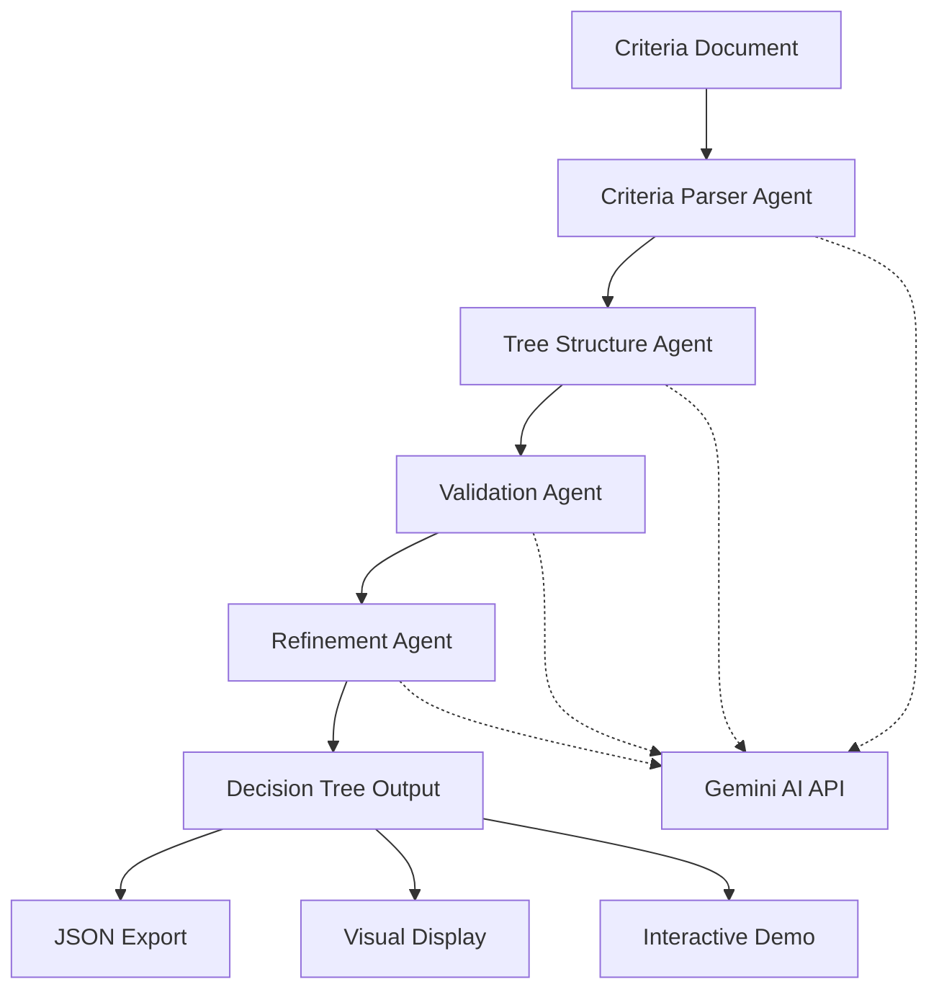
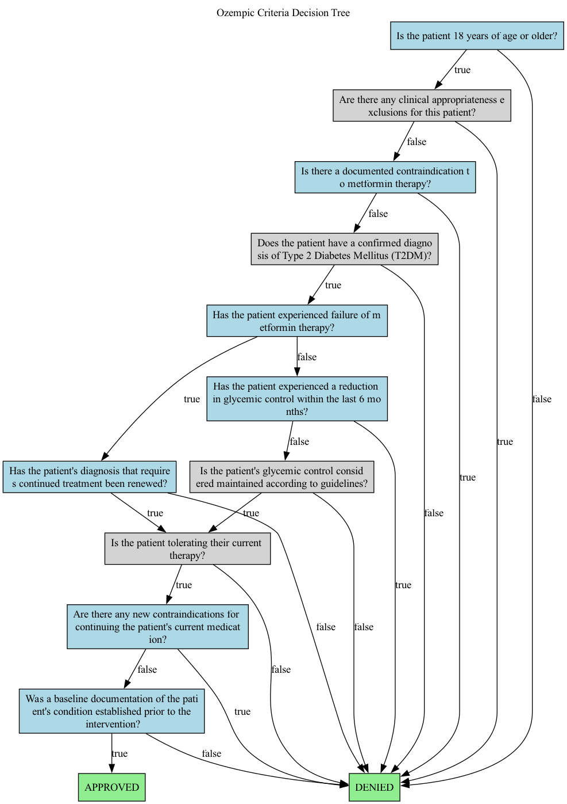
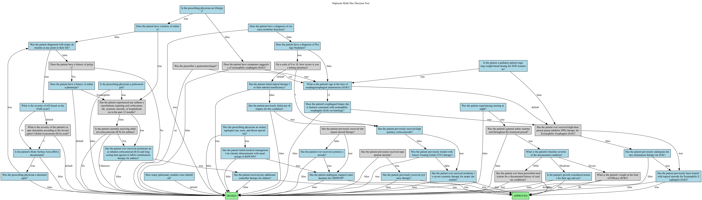

# Prior Authorization Decision Tree Demo

<div align="center">

**🚀 AI-Powered Clinical Workflow System For Prior Authorization**

*Transform pharmaceutical criteria documents into intelligent decision trees*

</div>

## 📋 Overview

The Prior Authorization Decision Tree Demo is an AI system that automatically converts complex pharmaceutical criteria documents into structured, interactive decision trees. By leveraging LLM agents and intelligent processing pipelines, this system streamlines the prior authorization process for healthcare providers.

### 🎯 **What It Does**

- **📄 Document Processing**: Ingests pharmaceutical criteria documents (PDFs, text files) - for the moment, only text files are supported
- **🤖 AI Analysis**: Uses Google's Gemini AI to parse complex medical criteria
- **🌳 Tree Generation**: Creates structured decision trees with logical flow
- **✓ Validation**: Ensures logical consistency and completeness
- **🔧 Refinement**: Optimizes tree structure for clarity and efficiency
- **📊 Visualization**: Provides rich visual output and interactive demos

### 🏗️ **System Architecture**



## 🚀 Quick Start

### Prerequisites

- **Python 3.13+**
- **Google API Key** (for Gemini AI)
- **UV package manager** (recommended) or pip

### Installation

1. **Clone the repository**:
   ```bash
   git clone <repository-url>
   cd prior-authorization-demo
   ```

2. **Set up environment**:
   ```bash
   # Create virtual environment
   python -m venv .venv
   source .venv/bin/activate  # On Windows: .venv\Scripts\activate
   
   # Install dependencies
   uv sync
   ```

3. **Configure API access**:
   ```bash
   # Copy and edit environment file
   cp .env.example .env
   
   # Add your Google API key to .env
   echo "GOOGLE_API_KEY=your_api_key_here" >> .env
   ```

4. **Run the demos**:
   ```bash
   python demo.py run --verbose --batch
   python enhanced_demo.py run --batch --real-time
   ```
5. **Check visualizations of the decision trees**:
   ```bash
   python visualize_tree.py
   ```
The svg image files will be saved in the `outputs/visualizations` directory.


### 🎮 **Demo Modes**

| Mode | Description | Use Case |
|------|-------------|----------|
| **Interactive** | Step-by-step progression with user prompts | First-time exploration, presentations |
| **Batch** | Automated processing without user input | Automated testing, CI/CD |
| **Quick** | Fast processing with minimal visual output | Performance testing, quick validation |
| **Single Document** | Focus on one specific criteria file | Detailed analysis, debugging |

### 🖼️ **Visual Examples**

#### Pipeline Processing Display
```
╔══════════════════════════════════════════════════════════════════════════╗
                             Healthcare AI Demo                              
                                                                            
  PRIOR AUTHORIZATION                                                       
  DECISION TREE DEMO                                                        
                                                                            
  AI-Powered Clinical Workflow                                              
                                                                            
╚══════════════════════════════════════════════════════════════════════════╝

▶ PIPELINE STEP 1/4: Criteria Parsing
Document: ozempic_criteria.txt
████████████████████████████████████████ 100% • 8.3s
✓ Criteria Parsing: Success - Parsed 15 criteria successfully
```

#### Decision Tree Visualization
```
🌳 GENERATED DECISION TREE: Ozempic (semaglutide)
  Tree Structure                                                              
                                                                              
  Root: Patient Eligibility                                                  
  ├─ Age >= 18? ─→ [Yes] ─→ Diabetes Type Check                             
  │              └→ [No] ─→ DENY: Under 18                                   
  ├─ Type 2 Diabetes? ─→ [Yes] ─→ HbA1c Check                               
  │                    └→ [No] ─→ DENY: Not Type 2 DM                       
  └─ HbA1c >= 7.0? ─→ [Yes] ─→ APPROVE                                      
                     └→ [No] ─→ Additional Review Required                   
                                                                              
                                                                              
```

#### Generated Decision Tree Examples

The following image shows an actual decision tree generated by the system from the Ozempic criteria document. This tree was created by processing the criteria through our 4-agent AI pipeline and then visualized using the built-in visualization tools:



*This decision tree was generated from `examples/ozempic_criteria.txt` using the core functionality which generated the decision tree JSON file, then visualized using the built-in visualization tools. To generate the svg **after running the demo**, use `python visualize_tree.py`

The system can also compose complex decision trees from multiple documents. This is an actual decision tree synthesized from the two dupixent examples in the `examples` folder using `multi_doc_demo`:




#### Summary Report
```
📊 PROCESSING SUMMARY
╔════════════════╤════════════╤════════════╤════════════════════════╗
║ Document       │ Status     │ Time       │ Result                 ║
╠════════════════╪════════════╪════════════╪════════════════════════╣
║ Ozempic        │ ✓ Success  │ 45.2s      │ Decision Tree Generated║
║ Jardiance      │ ✓ Success  │ 38.7s      │ Decision Tree Generated║
║ CardioGuard    │ ✓ Success  │ 29.1s      │ Decision Tree Generated║
╚════════════════╧════════════╧════════════╧════════════════════════╝
```

### ⚙️ **Advanced Options**

The demos all have a number of options.
TODO: enumerate these here. For now, see the source code.

### 📁 **Output Structure**

After running the demo, you'll find organized outputs in the `outputs/` directory:

```
outputs/
├── decision_trees/           # Generated decision trees
│   ├── ozempic_decision_tree.json
│   ├── jardiance_decision_tree.json
│   └── cardioguard_decision_tree.json
├── reports/                  # Session and performance reports
│   └── demo_session_20250626_143022.json
└── logs/                     # Detailed processing logs
    └── demo_detailed.log
```

#### Sample Decision Tree JSON
```json
{
  "metadata": {
    "document": "ozempic_criteria.txt",
    "generated_at": "2025-01-15T10:30:45Z",
    "pipeline_version": "1.0.0",
    "processing_time_seconds": 45.2,
    "api_calls": 4,
    "tokens_used": 2847
  },
  "decision_tree": {
    "nodes": [...],
    "connections": [...],
    "outcomes": [...]
  },
  "validation_results": {
    "is_valid": true,
    "issues": [],
    "score": 0.95
  }
}
```

## 🏛️ Architecture Deep Dive

### 🔧 **AI Pipeline Components**

The system uses a **4-Agent Architecture** that processes documents through distinct, specialized stages:

#### 1. **Criteria Parser Agent** 📄
- **Purpose**: Extracts and structures medical criteria from raw text
- **Input**: Raw document text (PDF, TXT, OCR output)
- **Output**: Structured criteria with parameters, thresholds, and conditions
- **AI Model**: Gemini for natural language understanding

#### 2. **Tree Structure Agent** 🌳
- **Purpose**: Creates logical decision tree structure from parsed criteria
- **Input**: Structured criteria from Parser Agent
- **Output**: Initial decision tree with nodes, connections, and flow
- **AI Model**: Gemini for logical reasoning and tree construction

#### 3. **Validation Agent** ✓
- **Purpose**: Ensures logical consistency and completeness of the tree
- **Input**: Initial decision tree structure
- **Output**: Validation report with identified issues and recommendations
- **AI Model**: Gemini for logical analysis and quality assurance

#### 4. **Refinement Agent** 🔧
- **Purpose**: Optimizes tree structure and resolves validation issues
- **Input**: Decision tree + validation results
- **Output**: Final, optimized decision tree ready for use
- **AI Model**: Gemini for optimization and refinement

### 💻 **Technical Stack**

- **🐍 Python 3.13+**: Core language with modern async/await support
- **🤖 Google Gemini AI**: Advanced language model for medical text processing
- **📦 Pydantic**: Type-safe data validation and serialization
- **🎨 Rich**: Beautiful terminal formatting and progress display
- **⌨️ Typer**: Modern CLI framework with auto-completion
- **🧪 Pytest**: Comprehensive testing with 100% pass rate
- **⚡ UV**: Fast Python package management

### 📂 **Project Structure**

```
prior-authorization-demo/
├── src/                          # Source code
│   ├── agents/                   # AI processing agents
│   │   ├── criteria_parser_agent.py
│   │   ├── tree_structure_agent.py
│   │   ├── validation_agent.py
│   │   └── refinement_agent.py
│   ├── core/                     # Core infrastructure
│   │   ├── decision_tree_generator.py
│   │   ├── llm_client.py
│   │   ├── schemas.py
│   │   └── config.py
│   └── demo/                     # Demo-specific components
│       ├── orchestrator.py
│       ├── presenter.py
│       └── tracker.py
├── examples/                     # Sample pharmaceutical documents
│   ├── ozempic_criteria.txt
│   ├── jardiance_criteria.txt
│   └── cardioguard_criteria.txt
├── tests/                        # Comprehensive test suite
├── PLANS/                        # Design documentation
├── demo.py                       # Interactive demo script
└── README.md                     # This file
```

## 🧪 Testing & Quality Assurance

### 🧪 **Test Suite (WIP)**

```bash
# Run all tests
source .venv/bin/activate
pytest tests/

# Test results: 51/51 passing ✓
# - Agent tests: 37/37 passing
# - Integration tests: 10/10 passing  
# - Core component tests: 4/4 passing
```

### 📊 **Test Categories**

- **🤖 Agent Tests**: Individual AI agent functionality and error handling
- **🔗 Integration Tests**: End-to-end pipeline with real API calls
- **⚡ Performance Tests**: Processing speed and resource usage
- **🛡️ Error Handling**: Graceful degradation and recovery
- **📋 Schema Validation**: Data structure integrity and compatibility

### 🏆 **Quality Standards**

- **Type Safety**: Full Pydantic schema validation
- **Error Handling**: Comprehensive exception hierarchy
- **API Compatibility**: Gemini API schema compliance
- **Performance**: Optimized for speed and resource efficiency
- **Documentation**: Inline docs and comprehensive planning

## 💻 Development

### 🛠️ **Development Setup**

```bash
# Clone and setup
git clone <repository-url>
cd prior-authorization-demo
source .venv/bin/activate

# Install development dependencies
uv sync --dev

# Run tests
pytest tests/

# Run linting
ruff check src/
mypy src/

# Run demo in development mode
python demo.py run --verbose
```

# Visualizations
  Usage:
  python visualize_tree.py                    # Visualize all trees
  python visualize_tree.py path/to/file.json  # Single file
  python visualize_tree.py -f svg             # SVG output

### ➕ **Adding New Features**

1. **AI Agents**: Extend the agent system in `src/agents/`
2. **Demo Components**: Enhance visual features in `src/demo/`
3. **Core Logic**: Modify pipeline in `src/core/`
4. **Tests**: Add tests in `tests/` following existing patterns

### 🔧 **Environment Configuration**

Create `.env` file with required API keys:

```bash
# Google AI API (required)
GOOGLE_API_KEY=your_google_api_key_here

# Optional: Environment selection
ENVIRONMENT=development  # test, development, production

```

### ⚙️ **Configuration Options**

The system supports multiple environments with automatic model selection:

| Environment | Primary Model | Fallback Model | Use Case |
|-------------|---------------|----------------|----------|
| **test** | `gemini-2.5-flash-lite-preview-06-17` | `gemini-2.5-flash-preview-05-20` | Fast testing |
| **development** | `gemini-2.5-flash-preview-05-20` | `gemini-2.5-pro-preview-06-05` | Development work |
| **production** | `gemini-2.5-pro-preview-06-05` | `gemini-2.5-flash-preview-05-20` | Production quality |

## 📄 Example Documents

The project includes three real-world pharmaceutical criteria documents:

### 💊 **Ozempic (semaglutide)**
- **Indication**: Type 2 Diabetes Mellitus
- **Complexity**: High (multiple criteria, age restrictions, diagnostic requirements)
- **File**: `examples/ozempic_criteria.txt` (2,042 bytes)

### 💊 **Jardiance (empagliflozin)**
- **Indication**: Type 2 Diabetes with Cardiovascular Disease
- **Complexity**: Medium (cardiovascular considerations, diagnostic criteria)
- **File**: `examples/jardiance_criteria.txt` (1,115 bytes)

### 💊 **CardioGuard (propranolol)**
- **Indication**: Hypertension
- **Complexity**: Low (straightforward criteria, basic requirements)
- **File**: `examples/cardioguard_criteria.txt` (1,035 bytes)

- **Notes:** These examples are completely made up but are meant to be indicative of real-world criteria documents.
These documents represent varying complexity levels and provide comprehensive testing scenarios for the AI pipeline.
